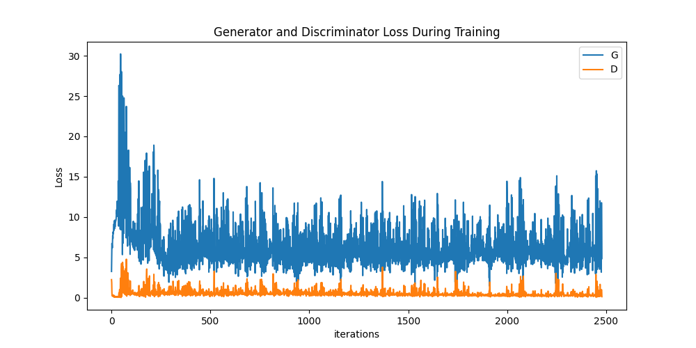

# Anime DCGAN - Image Generation


### Introduction
- This is project to demonstrate DCGAN architecture to generate Images trained on the dataset.
- The main of the architecture and parameters are in inspired from the very first research paper on DCGANs. 
> https://arxiv.org/abs/1511.06434
>    - UNSUPERVISED REPRESENTATION LEARNING
>    - WITH DEEP CONVOLUTIONAL
>    - GENERATIVE ADVERSARIAL NETWORKS
>    - 2016
- Data is taken from kaggle - The ANIME dataset.
- Kaggles Virtual machine were used, Tesla T4x2 to be precise.
- We might had used colab but it would need the data to be injected manuaaly from outside (i.e. downloading it and uploading it).
- The training took about 20 hrs in total for different architectures applied.

**DCGAN Model**

DCGAN, short for Deep Convolutional Generative Adversarial Network, is a type of neural network architecture designed for generating realistic images. It consists of two main components:


1. **Generator:**
   - Responsible for generating synthetic images.
   - Utilizes convolutional layers to transform random noise into meaningful data.
   - Output is intended to resemble real data from the training set.

2. **Discriminator:**
   - Functions as a binary classifier (real or fake) for images.
   - Employs convolutional layers to analyze and classify input images.
   - Trained to distinguish between genuine and generated images.

DCGANs are trained in a competitive manner where the generator improves its ability to generate realistic images by fooling the discriminator, and the discriminator enhances its accuracy in distinguishing real from generated images. This adversarial training process leads to the development of a generator capable of creating high-quality, authentic-looking images.


## Steps to run the project:

### 1. Dataset
- We use Anime Dataset available on Kaggle https://www.kaggle.com/datasets/splcher/animefacedataset
- This dataset has 63,632 "high-quality" anime faces.
- We use this dataset becauase it has a large number of images, which is benificial for training purpose

### 2.(a) Installing and Loading Necessary Libraries

The project utilizes various Python libraries, including PyTorch, PyTorch Ignite, Torchsummary, and others. These libraries are installed using the pip package manager within the Kaggle environment. The project also defines functions for weight initialization and sets up seed values for code reproducibility.

### 2.(b) Setting up Seed for Code Regeneration

Seed values are set to ensure reproducibility of the code. The torch manual seed is set to 999, and logger warnings for distributed training are appropriately configured.

### 3. Preprocessing Data

- **Prerocessing includes:**
    - Resize images to a square of size 64x64 pixels
    - Perform a center crop to focus on the central region of each image
    - Convert the images to PyTorch tensors
    - Normalize the pixel values to a range of [-1, 1] using mean (0.5, 0.5, 0.5) and standard deviation (0.5, 0.5, 0.5)
- **Load Training Dataset:**
    - Create a training dataset using the ImageFolder class.
    - Specify the root directory where the dataset is located and apply the defined data transformations.
    
- **Create Testing Subset:**
    - Generate a subset of the training dataset for testing.
    - The subset is created by selecting the first 3000 samples.

- **Set Batch Size:**
  - Define the batch size for training and testing datasets (here it is 128).
  - Batch Size can be chosen larger but it will lead in poor result. Same is the case for smaller batches.
- **Creating Training Dataloader**
- **Creating Testing Dataloader**
    - Why create a testing dataset?
        - Testing dataset plays a crucial role in evaluating the GAN's performance, both quantitatively through metrics like FID and IS, and qualitatively through visual inspection of generated images.

### 4. Setting up Variables

#### 4(a). Number of GPUs available We would use 0 for CPU mode.
- ngpu = 1

#### 4(b). Size of feature maps in discriminator
- ndf = 64
#### 4(c). Size of feature maps in generator
- ngf = 64
> The feature maps and latent vector size depends solely on the researcher, here considering the 
> computational cost and time complexity we take them to be 64 and 100 respectively.
> We can lower the feature maps and the latent vector but, it will return poor results, but
> increasing the value result in computational cost
#### 4(d). Number of channels in the training images. For color images this is 3
- nc = 3
####  4(e). latent space dimension of input vectors for the generator
> - latent_dim = 100
> For number of epochs we start with atleast 5 to check out the result and keep on incresing this value.

#### 4(f). Epochs
> - num_epochs = 50
> - We Tried for epoch = 5, 25, 50. Finally we got the best result for 50 epochs.

#### 4(g). Learning rates
- Learning rate for optimizers is preferred to be selected to be very low, good to go with 0.0002 or we may select even smaller value but it may result in computational cost.
- lr = 0.0002

#### 4(h). Beta1 hyperparam for Adam optimizers
- beta1 = 0.5
- This was finallized from the research paper reffered.

### 5. Model Design

#### 5(a). Creating a Generator Architecture

>   This model is motivated from the research paper from:
    https://arxiv.org/abs/1511.06434
    UNSUPERVISED REPRESENTATION LEARNING
    WITH DEEP CONVOLUTIONAL
    GENERATIVE ADVERSARIAL NETWORKS
    2016

>   The generator gradually upsamples the input noise through a series of transposed
    convolutional layers with batch normalization and ReLU activation until the final
    layer produces an output tensor with the same dimensions as the target images
    (64x64 in this case).
    
> Please refer to the research paper page 3-4.

> We have reduced the model architecture (in the research paper) starting from 1024
channels to 512 channels to take in account for the computational costs.

#### 5(b). Explainantion for the Generator network:

----------------------------------------------------------------
        Layer (type)               Output Shape         Param #
================================================================
   ConvTranspose2d-1            [-1, 512, 4, 4]         819,200
   ConvTranspose2d-2            [-1, 512, 4, 4]         819,200
       BatchNorm2d-3            [-1, 512, 4, 4]           1,024
       BatchNorm2d-4            [-1, 512, 4, 4]           1,024
              ReLU-5            [-1, 512, 4, 4]               0
   ConvTranspose2d-6            [-1, 256, 8, 8]       2,097,152
       BatchNorm2d-7            [-1, 256, 8, 8]             512
              ReLU-8            [-1, 256, 8, 8]               0
   ConvTranspose2d-9          [-1, 128, 16, 16]         524,288
      BatchNorm2d-10          [-1, 128, 16, 16]             256
             ReLU-11          [-1, 128, 16, 16]               0
  ConvTranspose2d-12           [-1, 64, 32, 32]         131,072
      BatchNorm2d-13           [-1, 64, 32, 32]             128
             ReLU-14           [-1, 64, 32, 32]               0
  ConvTranspose2d-15            [-1, 3, 64, 64]           3,072
             ReLU-16            [-1, 512, 4, 4]               0
  ConvTranspose2d-17            [-1, 256, 8, 8]       2,097,152
      BatchNorm2d-18            [-1, 256, 8, 8]             512
             ReLU-19            [-1, 256, 8, 8]               0
  ConvTranspose2d-20          [-1, 128, 16, 16]         524,288
      BatchNorm2d-21          [-1, 128, 16, 16]             256
             ReLU-22          [-1, 128, 16, 16]               0
  ConvTranspose2d-23           [-1, 64, 32, 32]         131,072
      BatchNorm2d-24           [-1, 64, 32, 32]             128
             ReLU-25           [-1, 64, 32, 32]               0
  ConvTranspose2d-26            [-1, 3, 64, 64]           3,072
             Tanh-27            [-1, 3, 64, 64]               0
        Generator-28            [-1, 3, 64, 64]               0
             Tanh-29            [-1, 3, 64, 64]               0
        Generator-30            [-1, 3, 64, 64]               0
================================================================
Total params: 7,153,408
Trainable params: 7,153,408
Non-trainable params: 0
----------------------------------------------------------------

- We use TransposeConv2d for upsampling the input.
- We select the Size of feature maps in generator and the Size of feature maps in discriminatoras 64 to both, because larger this value more potentially allow the model to capture more complex features but may require more computational resources. We might had selescted 32 or less but it may give poor result. Therefore we select 64 as a good point to start with.
- A larger latent vector might allow the generator to capture more intricate patterns. Therefore we select it to be 100.


- The generator has an input of a 1x1x100 vector, and the wanted output is a 3x64x64.
- We have the formula to evaluate the output size:
$$n_{\text{out}} = (n_{\text{in}} -1)\times s - 2p + (k-1) +1$$

```
# The first layer:
nn.ConvTranspose2d( in_channels=100, out_channels=512, 
                               kernel_size=4, stride=1, padding=0,bias=False),
            nn.BatchNorm2d(512),
            nn.ReLU(True),
            
```
$$n_{\text{out}} = (1-1)\times 1 - 2\times 0 + (4-1) +1  = 4$$

- The output size of the transposed convolution is 4x4, as indicated in the code.

- The next four convolutional layers are identical with a kernel size of four, a stride of two and a padding of one. This doubles the size of each input. So 4x4 turns to 8x8, then 16x16, 32x32 and finally, 64x64.

- **Batch normalization** standardizes the activations from a prior layer to have a zero mean and unit variance. This has the effect of stabilizing the training process.

- **Activation function ReLU** is used to address the vanishing gradient problem in deep convolutional neural networks and promote sparse activations (e.g. lots of zero values).


### 6. Discriminator Architecture
#### 6(a). Explainantion for the Discriminator network:

----------------------------------------------------------------
        Layer (type)               Output Shape         Param #
----------------------------------------------------------------
            Conv2d-1           [-1, 64, 32, 32]           3,072
            Conv2d-2           [-1, 64, 32, 32]           3,072
         LeakyReLU-3           [-1, 64, 32, 32]               0
         LeakyReLU-4           [-1, 64, 32, 32]               0
            Conv2d-5          [-1, 128, 16, 16]         131,072
       BatchNorm2d-6          [-1, 128, 16, 16]             256
         LeakyReLU-7          [-1, 128, 16, 16]               0
            Conv2d-8          [-1, 128, 16, 16]         131,072
       BatchNorm2d-9          [-1, 128, 16, 16]             256
        LeakyReLU-10          [-1, 128, 16, 16]               0
           Conv2d-11            [-1, 256, 8, 8]         524,288
      BatchNorm2d-12            [-1, 256, 8, 8]             512
        LeakyReLU-13            [-1, 256, 8, 8]               0
           Conv2d-14            [-1, 256, 8, 8]         524,288
      BatchNorm2d-15            [-1, 256, 8, 8]             512
        LeakyReLU-16            [-1, 256, 8, 8]               0
           Conv2d-17            [-1, 512, 4, 4]       2,097,152
      BatchNorm2d-18            [-1, 512, 4, 4]           1,024
        LeakyReLU-19            [-1, 512, 4, 4]               0
           Conv2d-20            [-1, 512, 4, 4]       2,097,152
      BatchNorm2d-21            [-1, 512, 4, 4]           1,024
        LeakyReLU-22            [-1, 512, 4, 4]               0
           Conv2d-23              [-1, 1, 1, 1]           8,192
           Conv2d-24              [-1, 1, 1, 1]           8,192
          Sigmoid-25              [-1, 1, 1, 1]               0
    Discriminator-26              [-1, 1, 1, 1]               0
          Sigmoid-27              [-1, 1, 1, 1]               0
    Discriminator-28              [-1, 1, 1, 1]               0
----------------------------------------------------------------


- We use Conv2d for downsampling the input (i.e. the output generated by the generator.).
- The input size to the discriminator is a 3x64x64 image, the output size is a binary 1x1 scalar. 
- We have the formula to evaluate the output size:

$$
n_{\text{out}} = \frac{{(n_{\text{in}} + 2p - k)}}{s} + 1
$$


```
# The first layer:
# Input: 64x64x3, Output: 32x32x64
            nn.Conv2d(3, 64, 4, 2, 1, bias=False),
            nn.LeakyReLU(0.2, inplace=True),            
```
$$n_{\text{out}} = \frac{64 + 2\times1 - 4}{2} + 1 = 32$$
- The output size of the transposed convolution is 4x4, as indicated in the code.

- The next four convolutional layers are identical with a kernel size of four, a stride of two and a padding of one. This doubles the size of each input. So 4x4 turns to 8x8, then 16x16, 32x32 and finally, 64x64.

#### 6(b). Why using the leaky relu?
- Leaky ReLU (Rectified Linear Unit) is a type of activation function that allows a small, non-zero gradient when the input is negative. It is defined as:

$$
\text{Leaky ReLU}(x) = \begin{cases} 
x & \text{if } x > 0 \\
\text{negative\_slope} \times x & \text{otherwise}
\end{cases}
$$
- ReLU is recommended for the generator, but not for the discriminator model. Instead, a variation of ReLU that allows values less than zero, called Leaky ReLU, is preferred in the discriminator.

### 7. Loss functions and Optimizers
#### 7(a). Initialize BCELoss function
criterion = nn.BCELoss()
fixed_noise = torch.randn(64, latent_dim, 1, 1, device=idist.device())
> fixed_noise is a 4-dimensional tensor with a shape of (64, 100, 1, 1). Each of the
64 samples has 100 values, and the spatial dimensions are 1x1.


#### 7(b). Setup Adam optimizers for both G and D
> Additionally, we find leaving the momentum term β1 at the suggested value of 0.9
resulted in training oscillation and instability while reducing it to 0.5 helped
stabilize training.

### 8. Model Training
- In short, during each training step, the discriminator is trained to distinguish between real and fake data, while the generator is trained to generate data that can "fool" the discriminator into classifying it as real. The losses and metrics are then returned for monitoring the training process.

- **Since, we use Pytorch and ignite. We follow the Documentation provided to start the training process**
- Steps involved:
    1. Engine Initialization: `trainer = Engine(training_step)`
        - Initializes an Ignite Engine for training using the training_step function defined earlier. The training_step function represents one iteration of the training process.
    2. Weight Initialization Function: `initialize_fn(m)`
        - This function initializes the weights of the neural network (netD and netG). It uses normal distribution for weights and sets them based on the type of layer (Convolutional or BatchNorm). This function is applied to the model weights during the training process.
    3. Initialization of Weights at the Start:
        - `@trainer.on(Events.STARTED)`:
            - Registers an event handler to be triggered when the training starts.
        - `init_weights()`:
            - Applies the weight initialization function (initialize_fn) to the discriminator (netD) and generator (netG) models.
    4. Lists for Storing Losses and Images:
        - `G_losses` and `D_losses` are lists initialized to store generator and discriminator losses during training.
        - img_list is initialized to store generated images at specific intervals.

    5. Event Handler for Storing Losses:
        - `@trainer.on(Events.ITERATION_COMPLETED)`:
            - Registers an event handler to be triggered after each iteration of the training process.
        - `store_losses(engine)`:
            - Appends the generator and discriminator losses (Loss_G and Loss_D) from the current iteration to the respective lists (G_losses and D_losses).
    6. Event Handler for Storing Images:
        - `@trainer.on(Events.ITERATION_COMPLETED(every=500))`:
            - Registers an event handler to be triggered after every 500 iterations.
        - `store_images(engine)`:
            - Generates fake images using the generator (netG) with a fixed noise vector (fixed_noise) and appends them to the img_list.


### 9. Model Evaluation Metrics

#### 9(a). Frechet Inception Distance (FID) and Inception Score (IS)

- **Frechet Inception Distance (FID):**
  - Measures the similarity between real and generated images.
  - Lower FID indicates better quality and diversity of generated images.
  - Computed using statistics from the InceptionV3 model.

- **Inception Score (IS):**
  - Measures the quality and diversity of generated images.
  - Higher IS indicates better image quality and diversity.
  - Calculated based on the predicted class probabilities from the InceptionV3 model.

#### 9(b). Loss of Generator (LossG) and Loss of Discriminator (LossD)

- **Loss of Generator (LossG):**
  - Measures how well the generator is performing.
  - A lower LossG indicates the generator is producing more realistic images.

- **Loss of Discriminator (LossD):**
  - Measures how well the discriminator is distinguishing between real and generated images.
  - A lower LossD indicates better performance of the discriminator.


- Frechet Inception Distance (FID) and Inception Score (IS)

   - Evaluation metrics, including FID and IS, are utilized to assess the quality and diversity of the generated images. The metrics are calculated using statistics from the InceptionV3 model.


### 10. Model Comparision
#### 10(a). Loss Comparision
> - **Model with 5 Epochs**

- We can see a lot of fluctuations in the graph. It is not stable, also the loss values are high for the Generator
> - **Model with 25 Epochs**

- Now, the fluctuations is now more stable  in the graph as it approach the last epoch. We may, try for number of epochs.
> - **Model with 50 Epochs**

- Now, the fluctuations is now more stable than the both the above graph (Epoch 5 and 25).

#### 10(b). Frechet Inception Distance (FID) and Inception Score (IS)
> - **Model with 5 Epochs**

- We can see a lot of fluctuations in the graph. It is not stable, we would like to see higher epoch values.
> - **Model with 25 Epochs**

- We can see that the fluctuations in the graph are more stable and indicate that if we go for more epochs the FID score may get higher and the IS values may also drop.
> - **Model with 50 Epochs**

- Now, the FID and IS values are oscillating among the same ranges respectively. But, we can go for more epoch or may increase the architecture size of the model.

#### 10(c). Images Generated
> - **Model with 5 Epochs**

- We see that images generated are not clear and produce non-suitable output.
> - **Model with 25 Epochs**

- Images are much clear and better, we may go for further epochs.
> - **Model with 50 Epochs**

- Images are now more clear and of more suitable output. Therefore, 50 Epochs might be a good to go value.

### 11. Conclusion
- We may conclude that the results get improving when we increase the epochs, and give better result at 50 epoch.
- One thing to note is taht we may increase the highest number of output channel from 512 to even more greater values. This may give us better result. But, overall increses the computational cost. As the Dataset is very large it will take a lot of time and computational cost. As this model took about 3 hrs for the 50 epochs (one may understand the time complexity and computational cost). 
- Therefore, we stop at 50 epochs and the channel size to 512 only.